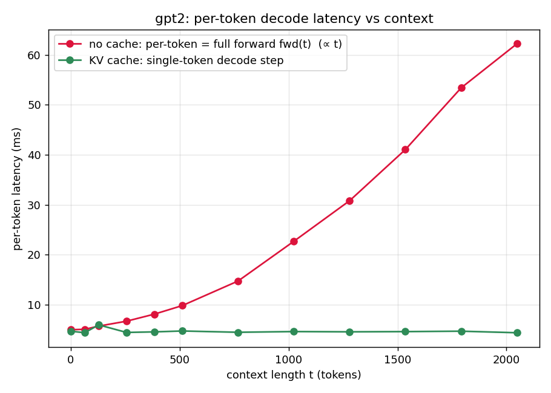
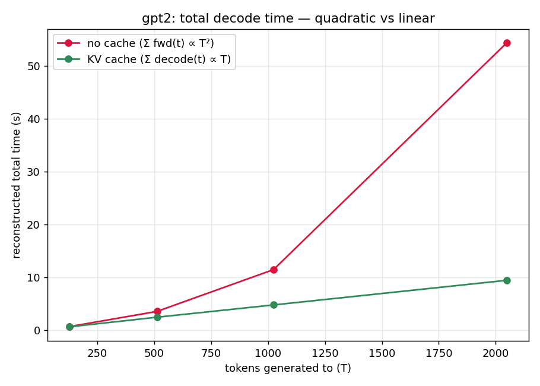
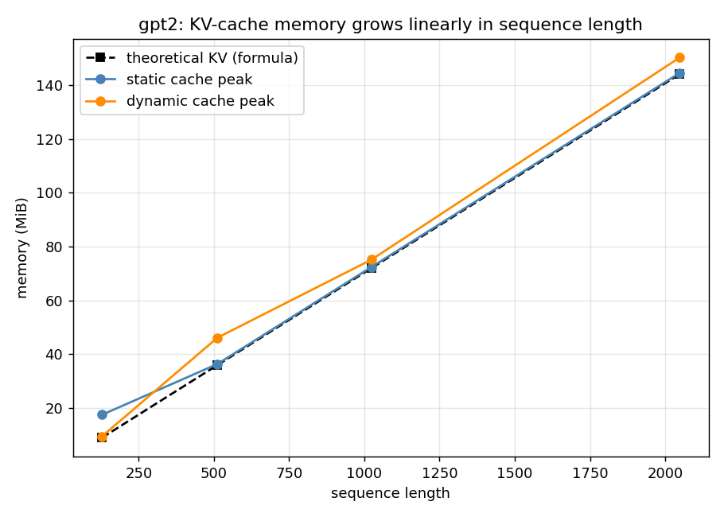
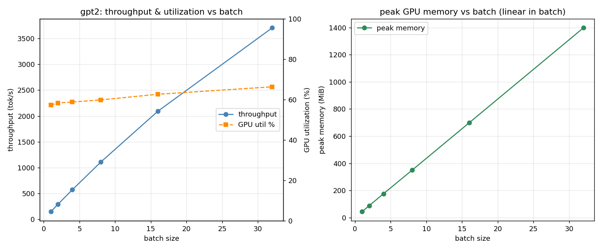
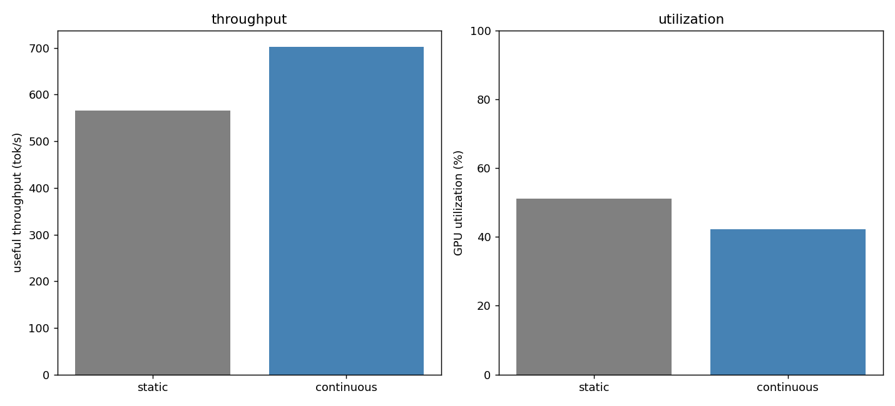
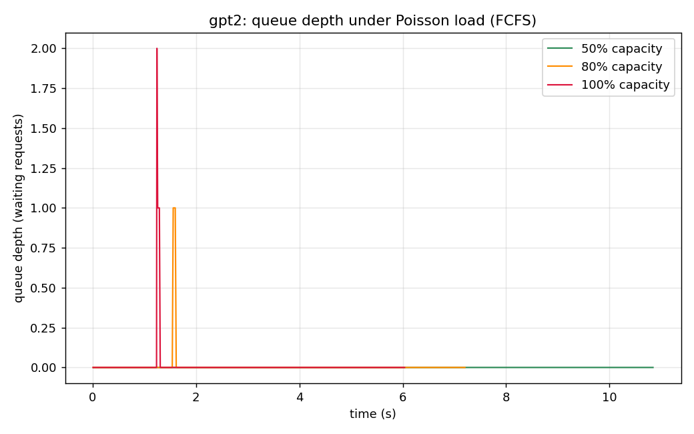
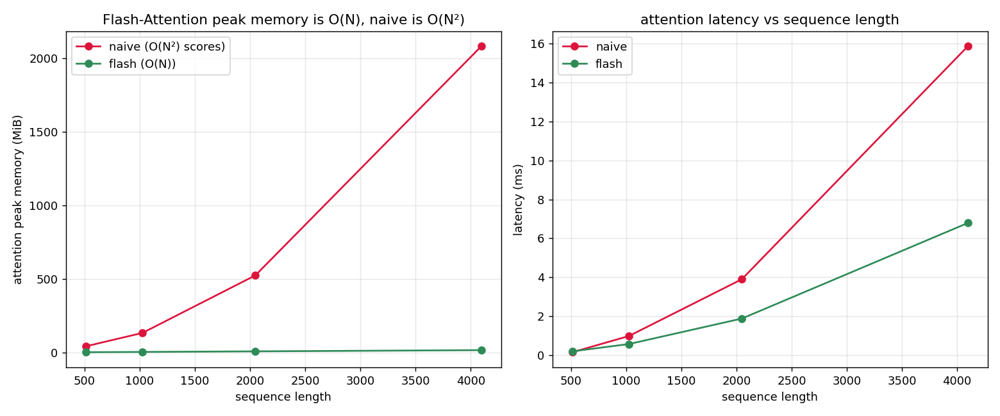
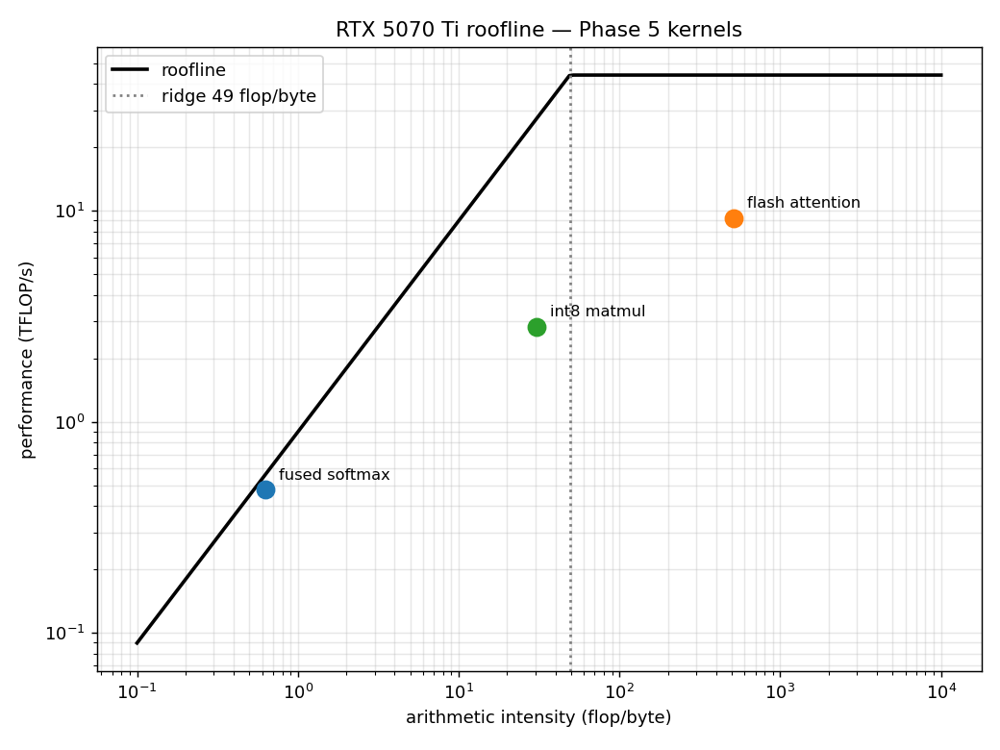

# Minimal LLM Inference Engine

A transformer inference engine built from first principles in raw PyTorch —
**no HuggingFace model classes, no vLLM, no TensorRT**. The goal is to demonstrate,
down to the tensor op and the memory byte, exactly what a production inference stack
does and why — starting from a verified GPT-2 forward pass and scaling up through
INT4 quantization, paged KV memory, speculative decoding, Qwen3 (dense + MoE), and
a full agentic loop.

See [`ARCHITECTURE.md`](ARCHITECTURE.md) for the system design and [`ROADMAP.md`](ROADMAP.md)
for per-phase implementation notes and usage snippets.

---

## What's built

| # | Phase | Key files |
|---|---|---|
| 1 | GPT-2 base: forward pass, KV cache, batching, Triton kernels | `engine/model.py`, `engine/kv_cache.py`, `engine/kernels/` |
| 2 | LLaMA architecture: RoPE, RMSNorm, SwiGLU, GQA | `engine/llama_*.py` |
| 3 | INT4 quantization W4A16 (per-group, JIT dequant) | `engine/quantize.py` |
| 4 | Paged KV cache + continuous batching | `engine/paged_cache.py`, `engine/llama_paged_engine.py` |
| 5 | Speculative decoding | `engine/speculative.py` |
| 6 | Qwen3 dense + tokenizer; Qwen3-MoE + expert CPU offload | `engine/qwen_tokenizer.py`, `engine/llama_moe.py`, `engine/moe_offload.py` |
| 7 | Chat template + full agentic loop | `engine/chat.py`, `engine/tool_parser.py`, `engine/agent.py` |

Full test suite: `pytest tests/ --ignore=tests/test_llama_smollm2.py` → **179 passed**.

---

## GPT-2 foundation

### Forward pass

A complete GPT-2 forward pass with every tensor op annotated with its shape:

- Token + learned positional embeddings
- Multi-head causal self-attention with explicit Q/K/V projections and scaled dot-product
- MLP with the `gelu_new` (tanh) activation
- LayerNorm implemented by hand (not `nn.LayerNorm`)
- Pre-norm residual blocks
- Final projection to vocab logits via weight tying
- Greedy, top-k, and top-p (nucleus) decoding

The engine has zero HuggingFace dependency — weights are read from a `safetensors` file
with raw torch (`engine/weights.py`), and tokenization uses `tiktoken`.

### Correctness verification

The forward pass matches HuggingFace GPT-2 token-for-token. The test uses
`GPT2LMHeadModel` purely as an oracle (never imported by `engine/`), pinned to
`attn_implementation="eager"` for an apples-to-apples comparison.

Three checks, fp32, fixed inputs, across four prompts:

1. **Tokenizer parity** — `tiktoken` GPT-2 ids match HuggingFace tokenizer ids.
2. **Teacher-forced logits** — per-position `argmax` is identical; max |Δlogit| is
   reported (observed **6e-5 – 9e-5**, i.e. pure fp32 accumulation noise).
3. **Greedy decoding** — identical token ids for ≥ 50 autoregressive steps.

```bash
pytest tests/test_llama_forward.py -v
```

### KV cache

Static (pre-allocated) and dynamic (growing) KV caches (`engine/kv_cache.py`), with
attention and the decode loop made cache-aware while keeping the no-cache path
byte-identical. Cached greedy decode is token-for-token identical to the no-cache path,
and the empirical cache size matches the first-principles formula
`2·n_layer·n_head·head_dim·seq·batch·bytes` exactly.

**Headline result** — cached decode is flat at ~4.5 ms/token regardless of context, while
no-cache grows linearly (re-encoding the whole prefix every step). Per-token speedup reaches
**14.3× at 2048 tokens**; total generation goes from O(T²) to O(T):




KV-cache memory grows linearly and matches the formula to the byte (144 MiB/sequence at
seq=1024, fp32) — on 16 GiB, the cache (not the weights) becomes the memory bottleneck
at long context.



### Static batching

Left-pad N prompts to equal length and decode in lockstep (`engine/batching.py`).
This is the reference baseline all later optimizations report deltas against.

| batch | throughput (tok/s) | latency (ms/step) | peak mem (MiB) | GPU util |
|------:|-------------------:|------------------:|---------------:|---------:|
| 1  | 147  | 6.80 | 43.7   | 57% |
| 8  | 1109 | 7.21 | 349.3  | 60% |
| 32 | 3707 | 8.63 | 1398.1 | 66% |

32× the work for ~1.3× the latency — throughput scales ~25× while per-step latency barely
moves. Decode is memory/launch-bound, so small batches leave the GPU idle; that idle compute
is what continuous batching reclaims.



### Continuous batching

Iteration-level scheduling (`engine/continuous.py`): a fixed pool of KV slots where, every
decode step, finished sequences are evicted and queued requests fill the freed slots — no
waiting for the batch to drain, no padding to a shared length. Two schedulers: FCFS and SJF.

On a high-variance workload (chat-like: many short outputs, a few long), continuous batching
delivers **1.24× throughput over the static baseline** (22.1 vs 17.8 req/s) by evicting
finished sequences immediately. SJF cuts p50/mean latency vs FCFS at a slightly worse tail.




Two honest caveats: the win scales with output-length variance (on uniform short workloads
the serial-prefill overhead makes it ~0.9× static), and WDDM `nvidia-smi` utilization is
misleading (continuous reads lower despite higher throughput — tok/s is the honest metric).

### Triton kernels

Three kernels in `engine/kernels/`, each verified against a PyTorch reference and analyzed
on the GPU roofline (peak ~44 TFLOP/s FP32, 896 GB/s, ridge 49 flop/byte).
*(Triton on Blackwell sm_120 + WSL2 needs CPython headers its JIT can't find; the project
stages them locally and sets `CPATH` in `engine/kernels/__init__.py`.)*

- **Fused softmax** — matches `torch.softmax`; both saturate ~75% HBM at large rows
  (memory-bound, AI 0.62). Standalone softmax is already fused; the real win is fusing it
  into attention.
- **Flash-Attention** — tiled online-softmax forward. **Peak memory O(N) vs naive O(N²):
  16 MiB vs 2080 MiB at seq 4096 (130× less)**, 2.3× faster, growing with N. Eliminating
  the N² memory traffic makes it compute-bound (AI 512).
- **INT8 weight quant** — per-column W8A16: **+0.30% perplexity, 4× smaller weights**.
  The dequant-matmul is memory-bound at decode shapes; the kernel is slower than cuBLAS fp16
  (the memory saving is the realized benefit — speed needs tensor-core INT8).




### Profiling

`torch.profiler` on the cached-decode hot path shows **~70% of time in linear-layer matmuls
running as GEMVs — memory-bound weight streaming**, the empirical proof that transformer
inference is a memory problem, not a compute one. The full progression:

| stage | tok/s | vs naive | peak mem |
|-------|------:|---------:|---------:|
| naive (no cache) | 145 | 1.0× | 74.7 MiB |
| + KV cache | 207 | 1.4× (11.9× at seq 1024) | 27.3 MiB |
| + static batching ×16 | 2725 | **18.7×** | 421 MiB |
| + continuous batching | 1836 | 12.6× (+1.24× on variable load) | 235 MiB |

Top bottlenecks: linear GEMVs (53%), residual/bias adds (13%), LayerNorm (10%), attention
bmm (4%). Every optimization — KV cache, batching, quantization, Flash-Attention — reduces
to moving fewer bytes, exactly what the roofline predicts.

---

## Scale-up: LLaMA → Qwen3 → MoE → Agentic

See [`ROADMAP.md`](ROADMAP.md) for detailed per-phase notes and correctness gates.
Below are quick-start snippets for each tier.

### LLaMA / Qwen3 dense inference

```python
import torch
from engine import load_llama_weights, QWEN3_8B, LlamaModel, QwenTokenizer

weights = load_llama_weights("/path/to/Qwen3-8B", QWEN3_8B, dtype=torch.bfloat16)
model   = LlamaModel(weights, QWEN3_8B)
tok     = QwenTokenizer("/path/to/Qwen3-8B")
ids     = tok.encode("The capital of France is")
print(tok.decode(model.generate(torch.tensor([ids]), max_new_tokens=20)[0].tolist()))
```

### INT4 quantization (W4A16)

Per-group symmetric INT4 with JIT dequant — one layer in full float at a time, so peak
memory overhead equals exactly one layer's weights.

```python
from engine import load_llama_weights, QWEN3_8B
from engine.quantize import quantize_llama

weights = load_llama_weights("/path/to/Qwen3-8B", QWEN3_8B, dtype=torch.bfloat16)
q_weights = quantize_llama(weights, group_size=128)
# Memory: 8B bf16 = 16 GB → 8B INT4 = 4 GB
```

### Qwen3-MoE + expert CPU offload

Qwen3-30B-A3B: 128 routed experts + 1 shared expert per layer, top-8 active per token
(3B active parameters / 30B total). `ExpertOffloadManager` stores all expert weights as
pinned CPU tensors and copies only the active experts to VRAM per token — the full 30B MoE
fits on 16 GB.

```python
from engine import load_llama_weights, QWEN3_30B_A3B, LlamaModel, ExpertOffloadManager

weights = load_llama_weights("/path/to/Qwen3-30B-A3B", QWEN3_30B_A3B, dtype=torch.bfloat16)
model   = LlamaModel(weights, QWEN3_30B_A3B)
mgr     = ExpertOffloadManager.from_weights(weights, QWEN3_30B_A3B, device="cuda")
```

### Agentic loop

Multi-turn tool-calling built on Qwen3's ChatML format. The loop generates a response,
detects `<tool_call>` blocks, dispatches registered Python functions, injects the results
as tool-role messages, and repeats — stopping when the model produces a final answer or
`max_turns` is reached.

```python
from engine import AgentLoop, Tool, QwenTokenizer, load_llama_weights, QWEN3_8B, LlamaModel
from engine.kv_cache import LlamaStaticKVCache

weights = load_llama_weights("/path/to/Qwen3-8B", QWEN3_8B, dtype=torch.bfloat16)
model   = LlamaModel(weights, QWEN3_8B)
tok     = QwenTokenizer("/path/to/Qwen3-8B")

agent = AgentLoop(
    model=model,
    tokenizer=tok,
    cache_factory=lambda: LlamaStaticKVCache(QWEN3_8B, batch=1, max_seq=4096, device="cuda"),
    tools=[Tool(
        name="add",
        description="Add two numbers.",
        parameters={
            "type": "object",
            "properties": {"a": {"type": "integer"}, "b": {"type": "integer"}},
            "required": ["a", "b"],
        },
        fn=lambda a, b: a + b,
    )],
    max_turns=8,
)
result = agent.run([{"role": "user", "content": "What is 17 + 25?"}])
print(result.final_text)        # "The answer is 42."
print(result.tool_calls_made)   # [ToolCall(name='add', arguments={'a': 17, 'b': 25})]
```

---

## Setup

This project runs in **WSL2 Ubuntu** with the repo on the Linux filesystem — required for
reliable Triton JIT support on Blackwell (sm_120) GPUs.

```bash
python3 -m venv --without-pip .venv
curl -fsSL https://bootstrap.pypa.io/get-pip.py | ./.venv/bin/python
./.venv/bin/pip install torch --index-url https://download.pytorch.org/whl/cu128
./.venv/bin/pip install -r requirements.txt
```

Download GPT-2 weights (for the base engine tests):
```bash
./.venv/bin/python scripts/download_weights.py
```

Download a LLaMA/Qwen3 checkpoint (for scale-up phases):
```bash
./.venv/bin/python scripts/download_llama.py --model Qwen/Qwen3-8B --out /path/to/weights
```

Verify CUDA is reachable:
```bash
./.venv/bin/python -c "import torch; print(torch.cuda.is_available(), torch.cuda.get_device_capability())"
# -> True (12, 0)
```

---

## Layout

```
engine/
  config.py            model hyperparameters (GPT2Config, LlamaConfig, Qwen3 presets)
  weights.py           GPT-2 safetensors loader
  layers.py            primitives: rms_norm, silu, linear, gelu, RoPE
  attention.py         GPT-2 multi-head attention
  mlp.py               GPT-2 GELU MLP
  block.py             GPT-2 pre-norm block
  model.py             GPT-2 model + generate / generate_cached
  sampling.py          greedy / top-k / top-p (shared by GPT-2 and LLaMA)
  tokenizer.py         GPT-2 BPE via tiktoken
  kv_cache.py          LlamaStaticKVCache, DynamicKVCache, SlotKVCache
  batching.py          static batching: left-pad + lockstep decode
  continuous.py        continuous batching engine, FCFS/SJF schedulers
  llama_weights.py     LLaMA/Qwen3 safetensors loader (sharded)
  llama_attention.py   GQA attention + RoPE + optional QK-norm (Qwen3)
  llama_mlp.py         SwiGLU MLP
  llama_block.py       pre-norm block (dense or MoE path)
  llama_model.py       LlamaModel + generate_cached
  llama_moe.py         Qwen3-MoE router + expert dispatch
  moe_offload.py       ExpertOffloadManager (pinned CPU → VRAM)
  quantize.py          INT4 W4A16 per-group quantization
  speculative.py       SpeculativeDecoder + SpecStats
  paged_cache.py       BlockManager + PagedLlamaKVCache
  llama_paged_engine.py LlamaPagedEngine (continuous batching, paged memory)
  qwen_tokenizer.py    QwenTokenizer (tiktoken BPE, no HuggingFace)
  chat.py              format_messages() — Qwen3 ChatML formatter
  tool_parser.py       extract_tool_calls(), has_tool_call(), strip_thinking()
  agent.py             AgentLoop, Tool, AgentResult
  kernels/
    softmax.py         Triton fused softmax
    flash_attention.py Triton Flash-Attention (tiled online softmax)
    quant.py           Triton INT8 W8A16 matmul

scripts/
  download_weights.py  fetch GPT-2 safetensors
  download_llama.py    fetch LLaMA/Qwen3 checkpoints
  generate_llama.py    quick generation script for LLaMA/Qwen3 models

tests/
  test_llama_forward.py   LLaMA forward pass correctness (vs HuggingFace oracle)
  test_llama_smollm2.py   end-to-end with real SmolLM2-1.7B weights (requires download)
  test_int4_quant.py      INT4 quantization correctness + shape tests
  test_paged_cache.py     paged KV cache + continuous batching engine
  test_speculative.py     speculative decoding correctness
  test_qwen3_dense.py     Qwen3 dense model + tokenizer
  test_moe.py             Qwen3-MoE dispatch, expert offload, INT4 MoE quant
  test_agent.py           chat template, tool parser, agent loop (56 tests, no real weights)

plots/                 benchmark plots tracked in git
```
